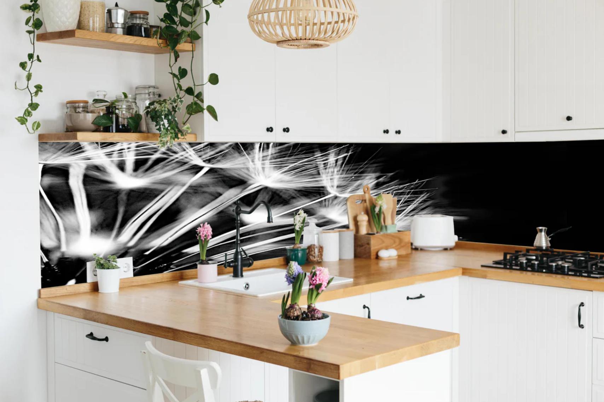

## Swiper Slider with Shopify Integration


## Project Overview

This project implements a SwiperJS slider in a Shopify theme. The slider displays multiple images, each linked to a product page. The slider includes navigation arrows and pagination bullets, with settings accessible through the Shopify Theme Customizer.

## Step-by-Step Documentation

1. HTML Structure
   The HTML structure defines the Swiper container and slides. Each slide contains an image and text overlay, and clicking on a slide redirects to the respective product page.

index.html

```
<!DOCTYPE html>
<html lang="en">
  <head>
    <meta charset="UTF-8" />
    <meta name="viewport" content="width=device-width, initial-scale=1.0" />
    <title>Swiper Slider App</title>
    <!-- SwiperJS CSS -->
    <link rel="stylesheet" href="https://unpkg.com/swiper/swiper-bundle.min.css" />
    <!-- Custom CSS -->
    <link rel="stylesheet" href="styles.css" />
  </head>
  <body>
    <div class="container">
      <p class="heading">Wunderschön - Ergebnisse unserer Kunden</p>
      <!-- Swiper Slider Container -->
      <div class="swiper">
        <div class="swiper-wrapper">
          <!-- Slides -->
          <div class="swiper-slide image-container" data-product-id="product1" onclick="redirectToProduct(this)">
            
            <div class="text-overlay">
              <p class="subtitle">Super Solid Glass - Glanz</p>
              <p class="subsubtitle">Polierter Onyxmarmor</p>
            </div>
          </div>
          <!-- Additional slides... -->
        </div>
        <!-- Swiper Navigation and Pagination -->
        <div class="swiper-navigation-pagination-container">
          <div class="swiper-button-prev"></div>
          <div class="swiper-pagination"></div>
          <div class="swiper-button-next"></div>
        </div>
      </div>
    </div>
    <!-- jQuery Library -->
    <script src="https://code.jquery.com/jquery-3.6.0.min.js"></script>
    <!-- SwiperJS Library -->
    <script src="https://unpkg.com/swiper/swiper-bundle.min.js"></script>
    <!-- Custom JavaScript -->
    <script src="script.js"></script>
    <script>
      // Function to redirect to the product page
      function redirectToProduct(element) {
        const productId = element.getAttribute("data-product-id");
        window.location.href = `/product/${productId}`;
      }
    </script>
  </body>
</html>
```

2. CSS Styling
   The CSS styles the Swiper slider, navigation buttons, pagination bullets, and text overlays.

styles.css

```
/* Swiper navigation buttons */
.swiper-button-next,
.swiper-button-prev {
  position: static;
  display: inline-block;
}

/* Hover effect for Swiper navigation buttons */
.swiper-button-next:hover,
.swiper-button-prev:hover {
  color: blue;
}

/* Swiper pagination bullet styling */
.swiper-pagination-bullet {
  background-color: blue;
}

/* Active Swiper pagination bullet styling */
.swiper-pagination-bullet-active {
  background-color: blue;
}

/* Heading styling */
.heading {
  font-size: 1.5rem;
  font-weight: bold;
  margin-bottom: 20px;
  color: #000000;
  display: flex;
  justify-content: center;
  align-items: center;
}

/* Subtitle styling */
.subtitle {
  margin: 20px 20px 0px;
  font-size: 1rem;
  text-align: left;
  line-height: 1.5;
}

/* Subsubtitle styling */
.subsubtitle {
  margin: 0px 20px 20px;
  font-size: 0.8rem;
  text-align: left;
  line-height: 1.5;
}

/* Image container styling */
.image-container {
  height: 80vh;
  display: flex;
  justify-content: center;
  align-items: center;
  position: relative;
}

/* Image styling within the image container */
.image-container img {
  max-height: 100%;
  max-width: 100%;
  object-fit: cover;
}

/* Text overlay styling */
.text-overlay {
  position: absolute;
  bottom: 0;
  width: 90%;
  background-color: rgba(0, 0, 0, 0.5);
  color: white;
  padding: 0px;
}

/* HTML element styling */
html {
  font-family: -apple-system, BlinkMacSystemFont, avenir next, avenir, segoe ui,
    helvetica neue, helvetica, Cantarell, Ubuntu, roboto, noto, arial,
    sans-serif;
}

/* Container styling */
.container {
  max-width: 800px;
  height: 80vh;
  margin: auto;
}

/* CSS variables for Swiper */
:root {
  --swiper-pagination-bullet-size: 20px;
  --swiper-navigation-size: 28px;
  --swiper-pagination-bottom: 20px;
  --swiper-theme-color: #fff;
  --swiper-pagination-bullet-inactive-color: #fff;
  --swiper-pagination-bullet-inactive-opacity: 0.3;
}
```

3. JavaScript Initialization
   The JavaScript initializes the Swiper slider and handles the click events for the slides.

script.js

```
$(document).ready(function () {
  // Initialize Swiper
  var swiper = new Swiper(".swiper", {
    // Pagination settings
    pagination: {
      clickable: false, // Disable clickable pagination bullets
      el: ".swiper-pagination", // Pagination element
    },
    // Navigation settings
    navigation: {
      nextEl: ".swiper-button-next", // Next button element
      prevEl: ".swiper-button-prev", // Previous button element
    },
    // Swiper events
    on: {
      init: function () {
        // Scope the navigation button selection to the current Swiper instance
        var $pagination = $(this.el).find(".swiper-pagination");
        var $nextButton = $(this.el).find(".swiper-button-next");
        var $prevButton = $(this.el).find(".swiper-button-prev");

        // Prepend the prev button and append the next button to the pagination container
        $pagination.prepend($prevButton);
        $pagination.append($nextButton);
      },
    },
  });
});
```

In Addition, we can use the Shopify Schema like this -

4. Shopify Schema
   The schema defines settings for images and URLs, making them accessible through the Shopify Theme Customizer.

settings_schema.json

```
{
  "name": "Image Slider",
  "settings": [
    {
      "type": "image_picker",
      "id": "image_1",
      "label": "Image 1"
    },
    {
      "type": "url",
      "id": "url_1",
      "label": "URL 1"
    },
    {
      "type": "image_picker",
      "id": "image_2",
      "label": "Image 2"
    },
    {
      "type": "url",
      "id": "url_2",
      "label": "URL 2"
    }
    // Add more images and URLs as needed
  ]
}
```

5. Liquid Template
   The Liquid template uses the schema settings to render the slider with dynamic content.

template.liquid

```
<div class="swiper-container">
  <div class="swiper-wrapper">
    
      <div class="swiper-slide" data-url="{{ section.settings.url_1 }}">
        
      </div>
    
    
      <div class="swiper-slide" data-url="{{ section.settings.url_2 }}">
        
      </div>
    
    <!-- Add more slides as needed -->
  </div>
  <!-- Add Arrows -->
  <div class="swiper-button-next"></div>
  <div class="swiper-button-prev"></div>
</div>
```

## How It Works

1. HTML Structure: Defines the Swiper container and slides.

2. CSS Styling: Styles the Swiper slider, navigation buttons, pagination bullets, and text overlays.

3. JavaScript Initialization: Initializes SwiperJS and handles slide click events to redirect to product pages.

4. Shopify Schema: Defines settings for images and URLs, making them accessible through the Theme Customizer.

5. Liquid Template: Uses schema settings to render the slider with dynamic content.

This setup creates a fully functional Swiper slider in a Shopify theme, with customizable images and URLs accessible through the Theme Customizer.
